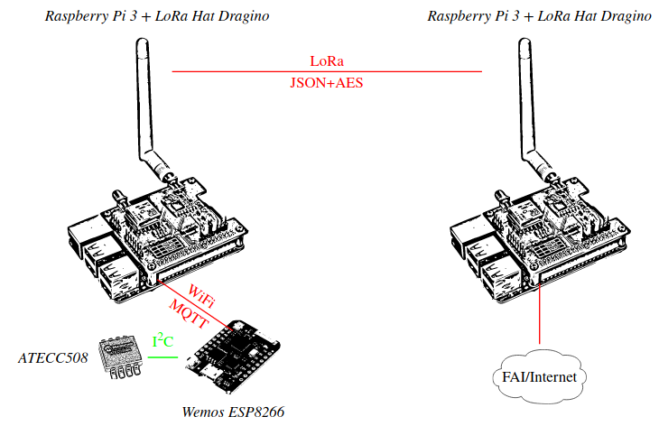
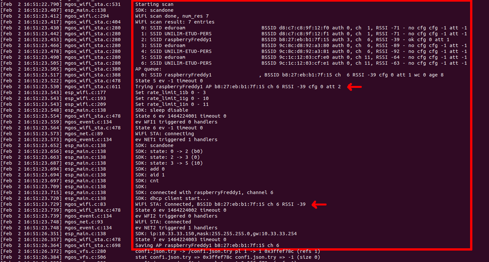
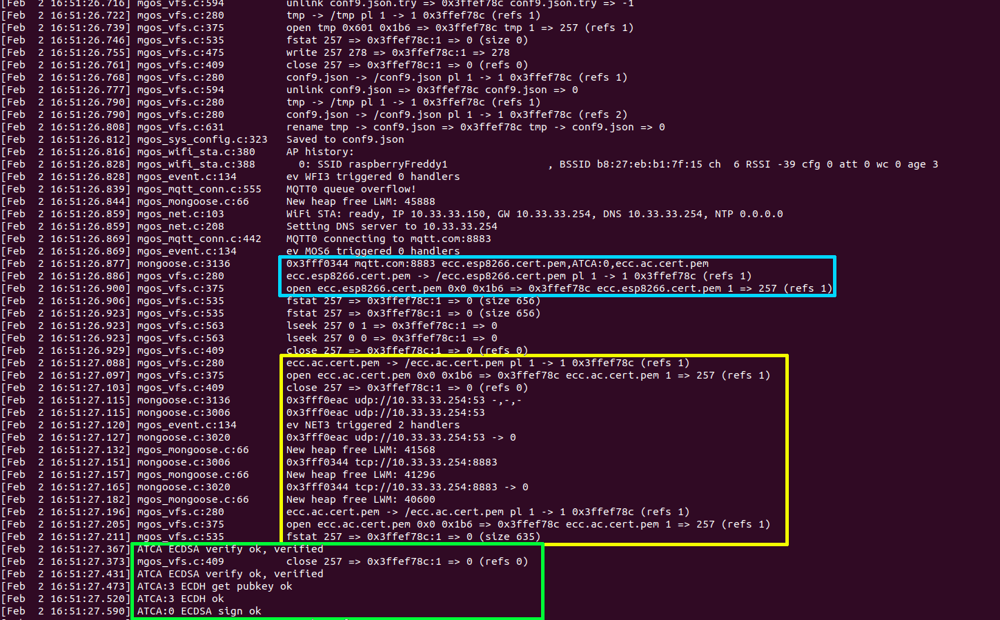
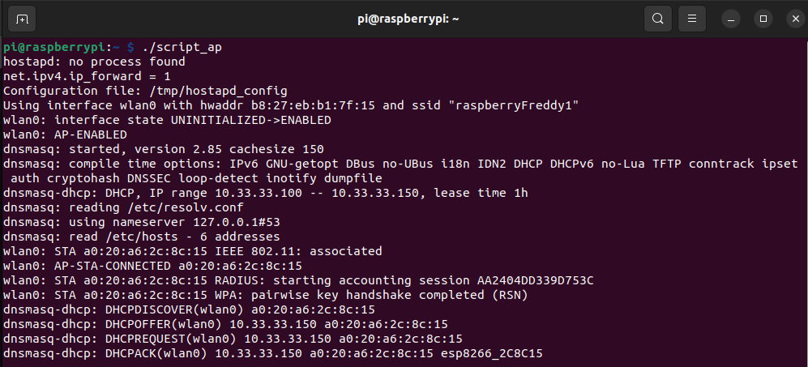
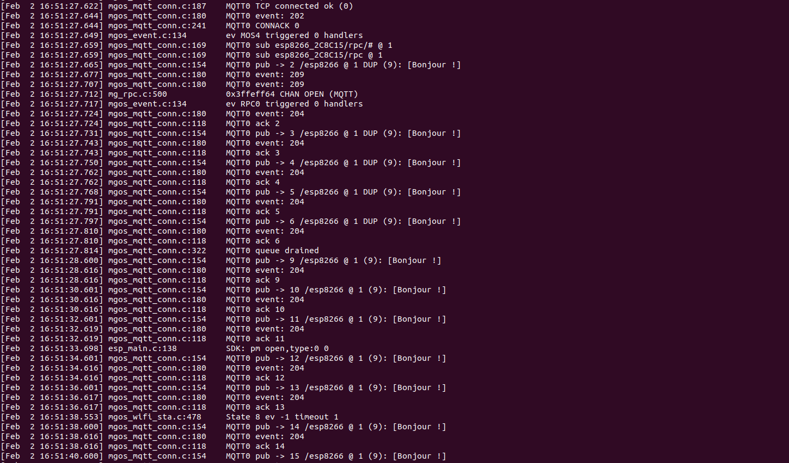
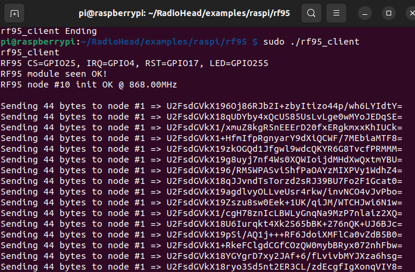
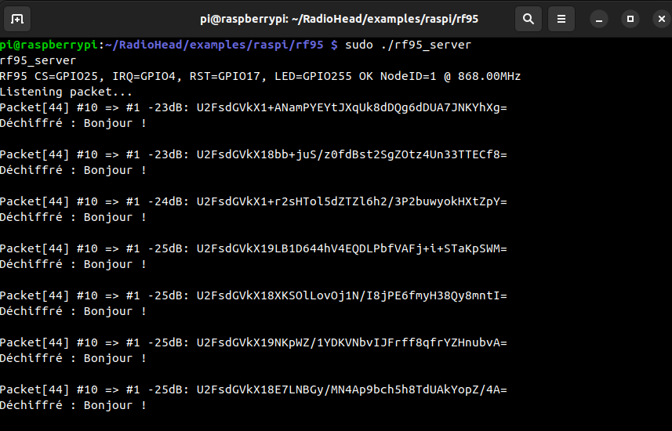

# Raspberry-ESP8266-Lora
Réseau de capteurs (ESP8266) connectés en Wi-Fi vers un Raspberry Pi communiquant en LoRa avec un autre Raspberry Pi.


# Table des matières

1. [Préparation du démarrage bootp, PXE du Raspberry Pi](#preparation)  
2. [Mise en service du serveur TFTP, DNS, DHCP](#serveurTFTPDNSDHCP)
3. [Chiffrement ECC : clés et certificats](#chiffrement)
4. [Configuration du Raspberry Pi concentrateur](#connexionServeur)
	a.  [Configuration de Mosquitto](#configMosquitto)
	b.  [Configuration du serveur Wi-Fi et DNS](#configServeur)
5. [Configuration de l'ESP8266](#configurationESP)
	a.  [Installation de MongooseOS](#installMGOS)
	b.  [Code et configuration de l'application](#codeESP)
	c.  [Ajout des clés et certificats, et exécution de l'application](#certificatsESP)
6. [Communication LoRa entre les deux Raspberry Pi](#communicationLoRa)
	a.  [Configuration pour activer les broches GPIOs et le bus SPI](#configSPI)
	b.  [Configuration du LoRa (bibliothèque RadioHead)](#configLoRa)
	c.  [Configuration du client LoRa (concentrateur)](#clientLoRa)
	d.  [Configuration du serveur LoRa](#serveurLoRa)
7. [Démonstration vidéo](#demonstrationVideo)
<hr/>
L'objectif est de réaliser :

- Un réseau de capteurs **connectés par WiFi** vers un concentrateur :
	- Ils utilisent le **protocole MQTT** pour remonter des mesures vers le concentrateur au travers d’une connexion WiFi;
	- Chaque capteur correspond à un ESP8266 intégré dans la carte de développement **Wemos**;
	- Un Raspberry Pi joue le rôle du concentrateur :
		- Il exécute un « broker » MQTT : logiciel mosquitto ;
		- Il sert de point d’accès WiFi : logiciel hostapd ;

- Chaque capteur exploite un circuit dédié à la manipulation de la **cryptographie sur courbes elliptiques** *ATECC608* connecté à l’*ESP8266* par le bus I2C. Il réalise :
	- L’authentification du serveur MQTT lors de la connexion en TLS ;
	- L’authentification du client auprès du serveur MQTT ;

- Le framework de développement est **Mongoose OS** permettant de :
	- Programmer le système embarqué ESP8266,
	- Disposer d’une implémentation de TLS,
	- Exploiter le composant ATECC608 pour réaliser les opérations de chiffrement / signature / vérification.

- Le concentrateur est relié vers une passerelle par l’utilisation des communications **LoRa** :
	- Chaque Raspberry Pi est “coiffé” d’un dragino, intégrant un “transceiver” LoRa ainsi qu’un GPS,
	- La communication d’une mesure est réalisée au travers de LoRa vers le Raspberry Pi connecté à Internet.


<h2 id="preparation"> Préparation du démarrage bootp, PXE du Raspberry Pi</h2>

Cette partie décrit comment démarrer un Raspberry Pi 3 par réseau et effectuer son montage NFS. Elle décrit les instructions fournis par Pierre-François Bonnefoi dans son cours de Terminaux Mobiles Communicants pour le Master CRYPTIS. Il est retrouvable sur le [lien suivant](http://p-fb.net/tmc/fiches/raspberry_pi_bootp_nfs.pdf).

<h2 id="serveurTFTPDNSDHCP"> Mise en service du serveur TFTP, DNS, DHCP</h2>

Une fois toute la configuration du Raspberry Pi faite, il faut utiliser le script ```server_tftp_dns_dhcp.sh``` afin de pouvoir démarrer par réseau le Raspberry Pi grâce à ```dnsmasq``` :

```bash
# interface du PC connexion Raspberry
IF=eno1
sudo nmcli device set $IF managed no
PREFIX=10.20.30
sudo sysctl -w net.ipv4.ip_forward=1
sudo ip link set dev $IF down
sudo ip link set dev $IF up
sudo ip address add dev $IF $PREFIX.1/24
sudo iptables -t nat -A POSTROUTING -s $PREFIX.0/24 -j MASQUERADE
sudo rm /tmp/leases
sudo dnsmasq -d -z -i $IF -F $PREFIX.100,$PREFIX.150,255.255.255.0,12h -O 3,$PREFIX.1 -O 6,8.8.8.8 --pxe-service=0,"Raspberry Pi Boot" --enable-tftp --tftp-root=/home/freddy/Bureau/TerminauxMobilesCommuniquants/RASPI/boot -l /tmp/leases
```
>**_Astuces:_**  

>Il est conseillé de relancer votre script offrant le DNS/TFTP/DHCP à votre Raspberry Pi dès que vous l’allumez ou après l’avoir éteint/rallumé : En effet, lorsque le Raspberry Pi est éteint, le câble Ethernet reliant votre PC au Raspberry Pi n’est plus alimenté par le Raspberry Pi et votre PC désactive son interface automatiquement ce qui bloque votre script. 😉️

>Enfin, il peut être nécessaire de préciser la configuration du pays pour le Wi-Fi du Raspberry :
```bash
$ rkfill unblock all &wpa_cli -i wlan0 set country FR & wpa_cli -i wlan0 save_config
```
<h2 id="chiffrement"> Chiffrement ECC : clés et certificats</h2>

Génération des clés privées de l'Autorité de Certification, du serveur Mosquitto et du client ESP8266 :
```bash
$ openssl ecparam -out ecc.ac.key.pem -name prime256v1 -genkey
$ openssl ecparam -out ecc.raspberry.key.pem -name prime256v1 -genkey
$ openssl ecparam -out ecc.esp8266.key.pem -name prime256v1 -genkey
```
Génération du certificat de l'Autorité de Certification qui sera auto-signé et utilisé pour signer les deux autres certificats :
```bash
$ openssl req -config <(printf "[req]\ndistinguished_name=dn\n[dn]\n[ext]\nbasicConstraints=CA:TRUE") -new -nodes -subj "/C=FR/L=Limoges/O=TMC/OU=IOT/CN=ACTMC" -x509 -extensions ext -sha256 -key ecc.ac.key.pem -text -out ecc.ac.cert.pem
```
Génération et signature du certificat pour le serveur Mosquitto :
```bash
$ openssl req -config <(printf "[req]\ndistinguished_name=dn\n[dn]\n[ext]\nbasicConstraints=CA:FALSE") -new -subj   "/C=FR/L=Limoges/O=TMC/OU=IOT/CN=mqtt.com" -reqexts ext -sha256 -key ecc.raspberry.key.pem -text -out ecc.raspberry.csr.pem
$ openssl x509 -req -days 3650 -CA ecc.ac.cert.pem -CAkey ecc.ac.key.pem -CAcreateserial -extfile <(printf   "basicConstraints=critical,CA:FALSE") -in ecc.csr.pem -text -out ecc.raspberry.cert.pem -addtrust clientAuth
```

Génération et signature du certificat pour le client ESP8266 :
```bash
$ openssl req -config <(printf "[req]\ndistinguished_name=dn\n[dn]\n[ext]\nbasicConstraints=CA:FALSE") -new -subj   "/C=FR/L=Limoges/O=TMC/OU=IOT/CN=esp8266" -reqexts ext -sha256 -key ecc.esp8266.key.pem -text -out ecc.esp8266.csr.pem
$ openssl x509 -req -days 3650 -CA ecc.ac.cert.pem -CAkey ecc.ac.key.pem -CAcreateserial -extfile <(printf   "basicConstraints=critical,CA:FALSE") -in ecc.esp8266.csr.pem -text -out ecc.esp8266.cert.pem -addtrust clientAuth
```

>***Remarques :***
>- *Les certificats du serveur MQTT et du client MQTT/Mongoose OS doivent avoir la même CA pour faciliter l’authentification du serveur auprès du client et vice-versa.*

>- *Le certificat du client pour être reconnu par Mongoose OS doit être entouré des lignes exactes :*  
>```
>-----BEGIN CERTIFICATE-----  
><Contenu en base64 du certificat>
>-----END CERTIFICATE-----
>```

<h2 id="connexionServeur"> Configuration du Raspberry Pi concentrateur</h2>

Le Raspberry à présent accessible, il est fera office de serveur pour les ESP8266. Il est donc nécessaire qu'il soit un point d'accès Wi-Fi pour que les capteurs puissent se connecter.

Pour cela, il faut installer les paquets **hostapd**, **iptables**, **dnsmasq**, **mosquitto** et **mosquitto-clients** sur le Raspberry :
```bash
$ sudo apt install hostapd iptables dnsmasq mosquitto mosquitto-clients
```

<h3 id="configMosquitto"> Configuration de Mosquitto </h3>

 Tout d'abord, il faut configurer le serveur Mosquitto afin qu'il puisse communiquer de manière sécurisé avec l'ESP8266. On va donc créer deux fichiers de configurations, l'un ```/etc/mosquitto/conf.d/tcp.conf``` pour dire que les communications TCP se font sur le port 1883 :

```
listener 1883
```

Et d'autre part, toutes les autres configurations ont lieu dans le fichier ```/etc/mosquitto/conf.d/tls.conf``` :
```
listener 8883

cafile /home/pi/ECC_CERTIFICATES/ecc.ac.cert.pem
certfile /home/pi/ECC_CERTIFICATES/ecc.raspberry.cert.pem
keyfile /home/pi/ECC_CERTIFICATES/ecc.raspberry.key.pem

require_certificate true
use_identity_as_username false
allow_anonymous false
password_file /etc/mosquitto/mosquitto_passwd
```
- Les communications TLS ont lieu sur le port 8883 *(Ce port demande obligatoirement de préciser l'option -CAfile pour effectuer des commandes Mosquitto)*,
- On précise les emplacements où se situent les certificats de l'AC et du serveur, ainsi que la clé du serveur, 
- L'option *« require_certificate true »* oblige le client à fournir un certificat pour communiquer,
- L'option *« use_identity_as_username false »* indique si le « CN », *« Common Name »*, du  
certificat doit correspondre ou non à l’utilisateur enregistré sur le serveur MQTT *(accès login/mdp)*,
- L'option *« allow_anonymous false »* empêche le client de se connecter sans préciser un couple (login/mdp),
- L'option *« password_file /etc/mosquitto/mosquitto_passwd»* permet de préciser où doivent être stockés les tuples (login/mdp)

Enfin, on utilise la commande  `mosquitto_passwd` pour créer le contenu du fichier mentionné précédemment, et on y crée le mot de passe de l'utilisateur *mqtt.tmc.com* :
```bash
$ sudo mosquitto_passwd -c /etc/mosquitto/mosquitto_passwd mqtt.tmc.com 
Enter password : tmctmctmc
Confirm password : tmctmctmc
```

Suite à ces configurations, on peut relancer le serveur pour prendre en compte les modifications effectués
```bash
sudo systemctl restart mosquitto.service
```

À ce stade, vous devriez pouvoir communiquer entre un publisher et un subscriber grâce aux commandes suivantes sur le Raspberry Pi :
```bash
mosquitto_pub -h localhost -p 8883 -u mqtt.tmc.com -P tmctmctmc -t '/esp8266' --cafile ECC_CERTIFICATES/ecc.ac.cert.pem --cert ECC_CERTIFICATES/ecc.raspberry.cert.pem --key ECC_CERTIFICATES/ecc.raspberry.key.pem -m 'Hello !'
```
```bash
mosquitto_sub -h localhost -p 8883 -u mqtt.tmc.com -P tmctmctmc -t '/esp8266' --cafile ECC_CERTIFICATES/ecc.ac.cert.pem --cert ECC_CERTIFICATES/ecc.esp8266.cert.pem --key ECC_CERTIFICATES/ecc.esp8266.key.pem
```
<h3 id="configServeur"> Configuration du serveur Wi-Fi et DNS</h3>

Maintenant que tout est fait pour que les échanges Mosquitto aient lieu, il faut à présent configurer le Raspberry, d'une part en serveur Wi-Fi graĉe à ***hostapd*** pour que l'ESP8266 puisse échanger son certificat avec le Raspberry, et d'autre part en serveur DNS pour que le Common Name du certificat du serveur MQTT soit associé à une adresse IP. Pour cela, nous associons le CN *« mqtt.com »* à l'adresse IP sur laquelle nous allons ouvrir notre serveur DNS :
```c
10.33.33.254		mqtt.com
```
Enfin, on lance le script   `script_ap` pour lancer les serveurs DNS et Wi-Fi : 
```bash
#!/bin/bash
INTERFACEWAN=eth0
INTERFACE=wlan0
SSID=raspberryFreddy1
PSK=RaspberryFred1
PREFIX=10.33.33
CFGHOSTAPD=/tmp/hostapd_config

cat <<END > $CFGHOSTAPD
interface=$INTERFACE
hw_mode=g
macaddr_acl=0
auth_algs=3
channel=6
ssid=$SSID
wpa=2
wpa_key_mgmt=WPA-PSK
wpa_pairwise=TKIP
rsn_pairwise=CCMP
wpa_passphrase=$PSK
END

sudo ip l set dev $INTERFACE down
sudo ip l set dev $INTERFACE up
sudo ip a flush dev $INTERFACE
sudo ip a add $PREFIX.254/24 dev $INTERFACE
sudo killall hostapd
sudo hostapd $CFGHOSTAPD &
sudo sysctl -w net.ipv4.ip_forward=1
sudo iptables -t nat -A POSTROUTING -s $PREFIX.0/24 -o $INTERFACEWAN -j MASQUERADE
sudo dnsmasq -d -z -a $PREFIX.254 -F $PREFIX.100,$PREFIX.150,255.255.255.0 -O 6,$PREFIX.254 -A /mqtt.com/$PREFIX.254 -l /tmp/leases
```
<h2 id="configurationESP"> Configuration de l'ESP8266</h2>

<h3 id="installMGOS"> Installation de MongooseOS </h3>

Pour commencer, nous déployons une application vierge sur Mongoose OS. En effet, nous développons en C directement en ligne de commande, ce qui nous permettra d’économiser la place prise par l’interprète Javascript de la version « développement Web » de Mongoose OS.

Pour cela, nous avons utilisé la documentation du [TP4 du cours de TMC](http://p-fb.net/tmc/fiches/TMC_TP_4_2022_2023.pdf) de Pierre-François Bonnefoi.

<h3 id="codeESP"> Code et configuration de l'application </h3>

Notre ESP8266 maintenant prêt, nous souhaitons qu'il exécute donc un script dans lequel il effectue un publishment Mosquitto sur le topic "/esp8266", dans lequel il envoie le message : "Bonjour !". On change donc le code source de l'application de la manière suivante :

```c
#include <stdio.h>  
#include "mgos.h"  
#include "mgos_mqtt.h"
  
static void my_timer_cb(void *arg) {  
	char *message = "Bonjour !";  
	mgos_mqtt_pub("/esp8266", message, strlen(message), 1, 0);  
	(void) arg;  
}  
enum mgos_app_init_result mgos_app_init(void) {  
	mgos_set_timer(2000, MGOS_TIMER_REPEAT, my_timer_cb, NULL);  
	return MGOS_APP_INIT_SUCCESS;  
}
```

Il est maintenant nécessaire d'indiquer dans le manifeste de l'application Mongoose, quels sont les paramètres pour se connecter au Wi-Fi, échanger les certificats de l'ESP et comment publier avec Mosquitto, et donc indiquer la configuration suivante dans le fichier  `mos.yml` :

```yml
author: mongoose-os  
description: A  Mongoose OS app skeleton  
version: 2.19.1  
libs_version: ${mos.version}  
modules_version: ${mos.version}  
mongoose_os_version: ${mos.version}  
# Optional. List of tags for online search.  
tags:  
- c  
# List of files / directories with C sources. No slashes at the end of dir names.  
sources:  
- src  
# List of dirs. Files from these dirs will be copied to the device filesystem  
filesystem:  
- fs  
build_vars:  
MGOS_MBEDTLS_ENABLE_ATCA: 1  
config_schema:  
- ["debug.level", 3]
- ["sys.atca.enable", "b", true, {title: "Enable the chip"}]
- ["i2c.enable", "b", true, {title: "Enable I2C"}]
- ["sys.atca.i2c_addr", "i", 0x60, {title: "I2C address of the chip"}]
- ["mqtt.enable", "b", true, {title: "Enable MQTT"}]
- ["mqtt.server", "s", "mqtt.com:8883", {title: "MQTT server"}]
- ["mqtt.pub", "s", "/esp8266", {title: "Publish topic"}]
- ["mqtt.user", "s", "esp", {title: "User name"}]
- ["mqtt.pass", "s", "tmctmctmc", {title: "Password"}]
- ["mqtt.ssl_ca_cert", "s", "ecc.ac.cert.pem", {title: "Verify server certificate using this CA bundle"}]
- ["mqtt.ssl_cert", "s", "ecc.esp8266.cert.pem", {title: "Client certificate to present to the server"}]
- ["mqtt.ssl_key", "ATCA:0"]
cdefs:  
MG_ENABLE_MQTT: 1  
# List of libraries used by this app, in order of initialisation  
libs:  
- origin: https://github.com/mongoose-os-libs/ca-bundle  
- origin: https://github.com/mongoose-os-libs/rpc-service-config  
- origin: https://github.com/mongoose-os-libs/rpc-service-atca  
- origin: https://github.com/mongoose-os-libs/rpc-service-fs  
- origin: https://github.com/mongoose-os-libs/rpc-mqtt  
- origin: https://github.com/mongoose-os-libs/rpc-uart  
- origin: https://github.com/mongoose-os-libs/wifi  
# Used by the mos tool to catch mos binaries incompatible with this file format  
manifest_version: 2017-09-29
```
<h3 id="certificatsESP"> Ajout des clés et certificats, et exécution de l'application </h3>

L'ESP8266 aura besoin du certificat de l'AC, son propre certificat et sa clé associée. Il faut ajouter donc les fichiers précédemment générés dans le dossier `fs` de l'application. Après cela, on peut compiler l'application grâce aux commandes suivantes :

```c
$  mos build --local --platform esp8266  
$  mos flash
```

Il faut ensuite installer la clé privée sur le composant *ATECCC608A*. En effet, l’activation et la configuration du composant ATECC608A est déja faite et bloquée sur les composants  
distribués. Mais elle autorise quand même l’installation à volonté de la clé privée associée à un certificat pour réaliser signature et authentification.

Pour la création et l’installation de la  clé d’installation dans l’ATECC508, puis pour l’installation de la clé privée ECC dans l’ATECC grâce à cette clé d’installation :

```bash
openssl rand -hex 32 > slot4.key
mos -X atca-set-key 0 ecc.esp8266.key.pem --write-key=slot4.key --dry-run=false
```

Enfin, pour que l'ESP8266 puisse se connecter au serveur Wi-Fi lancé sur le concentrateur, il est nécessaire de préciser sur quel SSID et avec quel mot de passe il doit se connecter :
```bash
mos wifi raspberryFreddy1 RaspberryFred1`
```

Tout est prêt, il n'y a plus qu'à lancer l'application grâce à la commande :
```bash
mos console
```
Du côté de MongooseOS, on peut apercevoir que l'application se connecte bien au réseau Wi-Fi raspberryFreddy1, et qu'elle arrive à s'authentifier (🟥 zone rouge) :


S'ensuit ensuite la phase d'échanges des certificats :


-  🟦 La zone bleue vérifie la conformité du certificat du client ESP8266, en comparant notamment la clé installé sur le composant ATECC608A avec celle fournie dans le certificat.
- 🟨 La zone jaune réalise l'authentification du client auprès du serveur MQTT, tout d'abord en requêtant le serveur DNS, puis en effectuant la connexion en TLS
- 🟩 La zone verte réalise l’authentification du serveur MQTT lors de la connexion en TLS, où l'ATECC608A vérifie la conformité du certificat de l'AC.

Enfin, sur le serveur DNS-DHCP ouvert avec  `script_ap` , on détecte bien la connexion ouverte avec l'ESP8266 : 



L'application commence alors à publier avec Mosquitto sur le port TCP 1883 des messages "Bonjour !" :


<h2 id="communicationLoRa"> Communication LoRa entre les deux Raspberry Pi</h2>

À présent, on souhaite transmettre de manière chiffrée (Avec AES) les publishments de l'application MongooseOS à un deuxième Raspberry Pi communiquant grâce à une antenne LoRa au concentrateur.

<h3 id="configSPI"> Configuration pour activer les broches GPIOs et le bus SPI </h3>

Avant toute chose, il faut activer sur les deux Raspberry Pi le bus SPI utilisé par le composant LoRa. Il faut modifier le fichier  ```/RASPI/boot/config.txt```  et activer les options suivants :
```bash
[...]
# Uncomment some or all of these to enable the optional hardware interfaces  
#dtparam=i2c_arm=on  
#dtparam=i2s=on  
dtparam=spi=on  
dtoverlay=gpio-no-irq
[...]
```

Il faut également installer la bibliothèque [bcm2835](http://www.airspayce.com/mikem/bcm2835/) qui nous permettra d'utiliser les broches GPIOs du Dragino du Raspberry Pi :
```bash
$ wget http://www.airspayce.com/mikem/bcm2835/bcm2835-1.71.tar.gz  
$ tar zxvf bcm2835-1.71.tar.gz  
$ cd bcm2835-1.71  
$ ./configure  
$ make  
$ sudo make check  
$ sudo make install
```
<h3 id="configLoRa"> Configuration du LoRa (bibliothèque RadioHead) </h3>

Pour  l’utilisation du LoRa, nous utilisons la bilbliothèque [RadioHead](https://github.com/hallard/RadioHead)  :
```bash
$ git clone https://github.com/hallard/RadioHead
```

Dans le dossier ```RadioHead/examples/raspi/rf95``` , il est nécessaire de configurer les fichiers ```rf95_client.cpp``` et « ```rf95_client```, pour sélectionner le Dragino :
```cpp
//  LoRasPi  board  
//  see  https://github.com/hallard/LoRasPI  
//#define  BOARD_LORASPI
//  Dragino  Raspberry  PI  hat  
//  see  https://github.com/dragino/Lora  
#define  BOARD_DRAGINO_PIHAT
```
Les deux Raspberry Pi peuvent alors communiquer en LoRa, le concentrateur jouant le rôle du client, et le deuxième Raspberry le rôle du serveur.

<h3 id="clientLoRa"> Configuration du client LoRa (concentrateur) </h3>

Le client LoRa doit récupérer la valeur publiée par l'ESP8266 avec Mosquitto, et la renvoyer chiffrée en AES au serveur LoRa. 
Pour cela, on utilise l'instruction  ```popen``` en C++, qui nous permet d'exécuter une commande, et d'ouvrir une redirection des résultats de la commande, pour qu'à chaque valeur reçue, nous puissions la traiter.
Ensuite, nous chiffrons chaque donnée reçue via un appel de la commande  ```openssl```,  demandant de la chiffrer en AES256 avec le mot de passe "tmctmctmc". Enfin, le résultat de la commande est converti en base64 et est ensuite envoyé par LoRa :
```c
int main (int argc, const char* argv[] )
{
	[...]
    const char* cmd = "mosquitto_sub -h mqtt.com -p 8883 -u esp -P tmctmctmc -t '/esp8266' --cafile /home/pi/ECC_CERTIFICATES/ecc.ac.cert.pem --cert /home/pi/ECC_CERTIFICATES/ecc.esp8266.cert.pem --key /home/pi/ECC_CERTIFICATES/ecc.esp8266.key.pem";
    array<char, 256> buffer;
    unique_ptr<FILE, decltype(&pclose)> pipe(popen(cmd, "r"), pclose);
    if (!pipe) 
	throw runtime_error("popen() failed!");

    while (!force_exit) {
	    while (fgets(buffer.data(), buffer.size(), pipe.get()) != nullptr) {
	        string cmd2 = "echo \"" + string(buffer.data()) +"\" | openssl enc -aes256 -pbkdf2 -pass pass:tmctmctmc -base64";
			unique_ptr<FILE, decltype(&pclose)> pipe(popen(cmd2.c_str(), "r"), pclose);
			fgets(buffer.data(), buffer.size(), pipe.get());
	
         	uint8_t len = string(buffer.data()).size() - 1;
         		
       	 	printf("\nSending %02d bytes to node #%d => ", len, RF_GATEWAY_ID );
        	printbuffer((uint8_t *)(buffer.data()), len);
        	rf95.send((uint8_t *)(buffer.data()), len);
	    }
      }
   }
   [...]
}
```
Voici à quoi ressemble les communications chiffrées envoyées par le client :


<h3 id="serveurLoRa"> Configuration du serveur LoRa</h3>

De la même manière,, on fait un appel de la commande  ```openssl```,  demandant de déchiffrer en AES256 avec le mot de passe "tmctmctmc" chaque valeur reçue, et on l'affiche :
```c
int main (int argc, const char* argv[] )
{
	[...]
	array<char, 256> buffer;

    if (rf95.recv(buf, &len)) {
          printf("Packet[%02d] #%d => #%d %ddB: ", len, from, to, rssi);
          printbuffer(buf, len);
          string str = reinterpret_cast<char *>(buf);

          string cmd = "echo \"" + str +"\" | openssl aes-256-cbc -d -pbkdf2 -a -pass pass:tmctmctmc";
          unique_ptr<FILE, decltype(&pclose)> pipe(popen(cmd.c_str(), "r"), pclose);
          fgets(buffer.data(), buffer.size(), pipe.get());

          uint8_t len = string(buffer.data()).size() - 1;

          printf("\nDéchiffré : %s ", buffer.data());       
    }
    [...]
} 
```
Voici à quoi ressemble les communications reçues et déchiffrées par le serveur :



<h2 id="demonstrationVideo"> Démonstration vidéo</h2>

https://www.youtube.com/watch?v=2tpa6m3sodY

## Auteurs

- **Fredéric CANAUD**  - [https://github.com/FredericCanaud](https://github.com/FredericCanaud)
- **Naïma BELMILOUDI** - [https://github.com/NSFB](https://github.com/NSFB)

