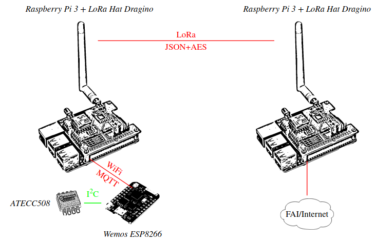

# Raspberry-ESP8266-Lora
Réseaux de capteurs (ESP8266) connectés en Wi-Fi vers des concentrateurs (Raspberry Pi 3)

# Table des matières

1. [Raspberry Pi & WiFi](#raspberry_et_wifi)  
	1. [Préparation du démarrage bootp, PXE du Raspberry Pi](#prearation)  
	2. [Mise en service du serveur TFTP, DNS, DHCP](#serveurTFTPDNSDHCP)
	3. [Connexion des ESP8266 au serveur Raspberry Pi par Wi-Fi](#connexionESPServeur)
<hr/>

L'objectif est de réaliser :

- Un réseau de capteurs **connectés par WiFi** vers un concentrateur :
	- Ils utilisent le **protocole MQTT** pour remonter des mesures vers le concentrateur au travers d’une connexion WiFi;
	- Chaque capteur correspond à un ESP8266 intégré dans la carte de développement **Wemos**;
	- Un Raspberry Pi joue le rôle du concentrateur :
		- Il exécute un « broker » MQTT : logiciel mosquitto ;
		- Il sert de point d’accès WiFi : logiciel hostapd ;

- Chaque capteur exploite un circuit dédié à la manipulation de la **cryptographie sur courbes elliptiques** *ATECC608* connecté à l’*ESP8266* par le bus I2C. Il réalise :
	- L’authentification du serveur MQTT lors de la connexion en TLS ;
	- L’authentification du client auprès du serveur MQTT ;

- Le framework de développement est **Mongoose OS** permettant de :
	- Programmer le système embarqué ESP8266,
	- Disposer d’une implémentation de TLS,
	- Exploiter le composant ATECC608 pour réaliser les opérations de chiffrement / signature / vérification.

- Le concentrateur est relié vers une passerelle par l’utilisation des communications **LoRa** :
	- Chaque Raspberry Pi est “coiffé” d’un dragino, intégrant un “transceiver” LoRa ainsi qu’un GPS,
	- La communication d’une mesure est réalisée au travers de LoRa vers le Raspberry Pi connecté à Internet.



<h2 id="raspberry_et_wifi"> Raspberry Pi et Wi-Fi</h2>

<h3 id="preparation"> Préparation du démarrage bootp, PXE du Raspberry Pi</h3>

Cette partie décrit comment démarrer un Raspberry Pi 3 par réseau et effectuer son montage NFS. Elle décrit les instructions fournis par Pierre-François Bonnefoi dans son cours de Terminaux Mobiles Communicants pour le Master CRYPTIS. Il est retrouvable sur le [ lien suivant]().

<h3 id="serveurTFTPDNSDHCP"> Mise en service du serveur TFTP, DNS, DHCP</h3>

Une fois toute la configuration du Raspberry Pi faite, il faut utiliser le script ```server_tftp_dns_dhcp.sh``` afin de pouvoir démarrer par réseau le Raspberry Pi grâce à ```dnsmasq``` :

```
# interface du PC connexion Raspberry
IF=eno1
sudo nmcli device set $IF managed no
PREFIX=10.20.30
sudo sysctl -w net.ipv4.ip_forward=1
sudo ip link set dev $IF down
sudo ip link set dev $IF up
sudo ip address add dev $IF $PREFIX.1/24
sudo iptables -t nat -A POSTROUTING -s $PREFIX.0/24 -j MASQUERADE
sudo rm /tmp/leases
sudo dnsmasq -d -z -i $IF -F $PREFIX.100,$PREFIX.150,255.255.255.0,12h -O 3,$PREFIX.1 -O 6,8.8.8.8 --pxe-service=0,"Raspberry Pi Boot" --enable-tftp --tftp-root=/home/freddy/Bureau/TerminauxMobilesCommuniquants/RASPI/boot -l /tmp/leases
```
>**_Astuces:_**  

>Il est conseillé de relancer votre script offrant le DNS/TFTP/DHCP à votre Raspberry Pi dès que vous l’allumez ou après l’avoir éteint/rallumé : En effet, lorsque le Raspberry Pi est éteint, le câble ethernet reliant votre PC au Raspberry Pi n’est plus alimenté par le Rapsberry Pi et votre PC désactive son interface automatiquement ce qui bloque votre script. 😉️

>Enfin, il peut être nécessaire de préciser la configuration du pays pour le Wi-Fi du Raspberry :
```
	$ rkfill unblock all &wpa_cli -i wlan0 set country FR & wpa_cli -i wlan0 save_config
```

<h3 id="connexionESPServeur"> Connexion des ESP8266 au serveur Raspberry Pi par Wi-Fi</h3>

Le Raspberry à présent accessible, il est fera office de serveur pour les ESP8266. Il est donc nécessaire qu'il soit un point d'accès Wi-Fi pour que les capteurs puissent se connecter.

Pour cela, il faut installer les paquets **hostapd**, **iptables** et **dnsmasq** sur le Raspberry :
```
$ sudo apt install hostapd iptables dnsmasq
```

## Auteurs

- **Fredéric CANAUD**  - [https://github.com/FredericCanaud](https://github.com/FredericCanaud)
- **Naïma BELMILOUDI** - [https://github.com/NSFB](https://github.com/NSFB)

<!--<script> window.scroll(0,20000000) </script> --> 
